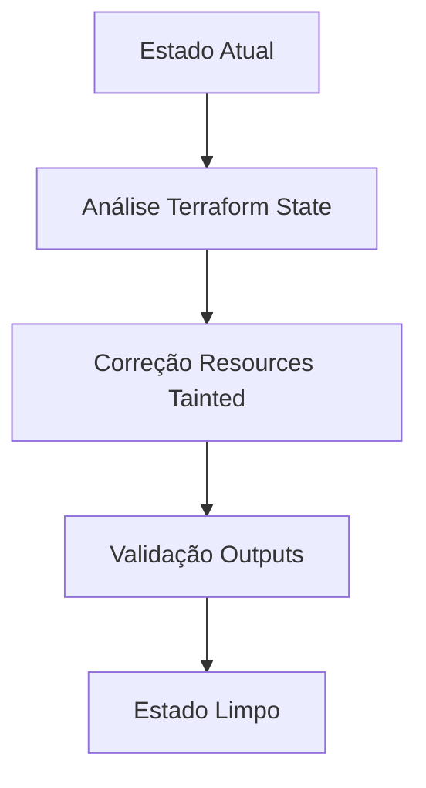
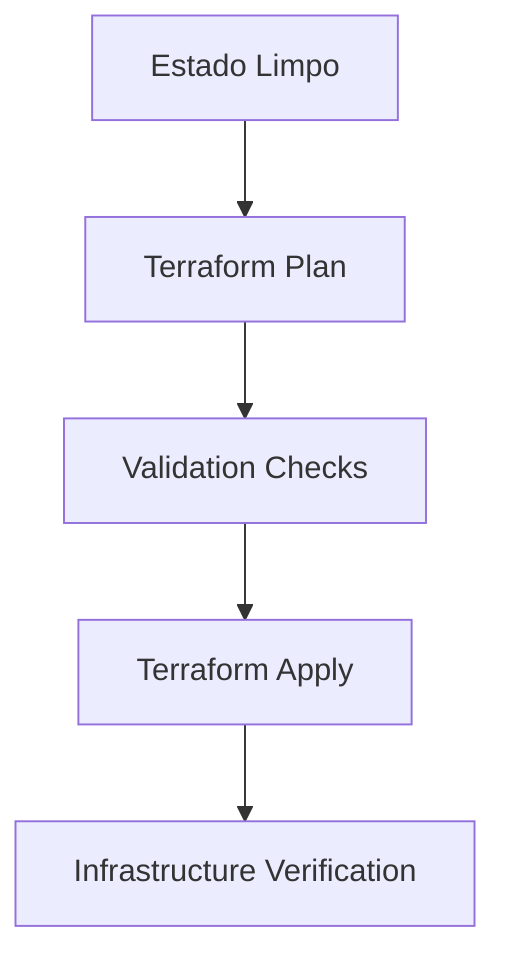
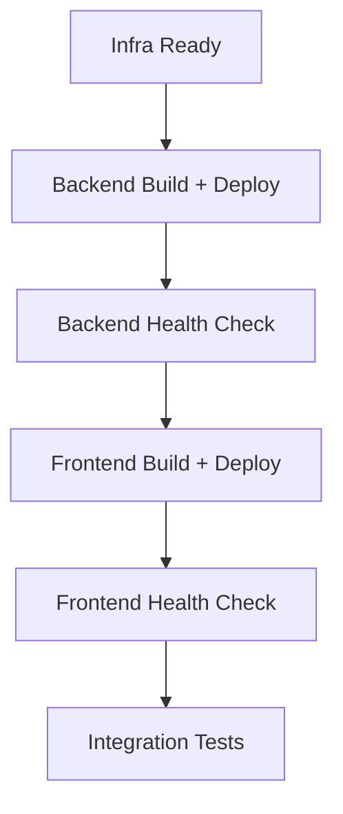
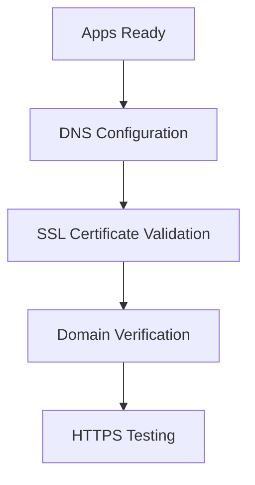
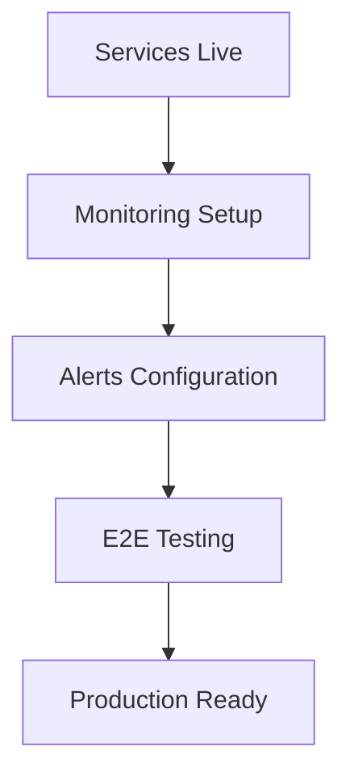

# DARWIN GCP Deployment Master Plan
## Plano Estruturado Completo para Deployment Production-Ready

---

## 🎯 **SITUAÇÃO ATUAL IDENTIFICADA**

### **Infraestrutura Parcialmente Deployada:**
- ✅ **VPC Network**: `darwin-production-vpc` (funcional)
- ✅ **Load Balancer IP**: `34.128.164.40` (ativo)
- ✅ **SSL Certificates**: `darwin-ssl-cert` (provisionado)
- ✅ **Database**: `darwin-production-db` PostgreSQL (ativo)
- ✅ **Redis**: `darwin-production-redis` (ativo)
- ✅ **Storage Buckets**: 5 buckets criados (backups, documents, logs, models, uploads)
- ⚠️ **Backend Cloud Run**: `TAINTED` (precisa reparo)
- ❌ **Frontend Cloud Run**: Não deployado
- ❌ **Monitoring**: Módulo não aplicado

### **URLs Configurados:**
- **API**: `api.agourakis.med.br` → `34.128.164.40`
- **Frontend**: `darwin.agourakis.med.br` → `34.128.164.40`

---

## 🔄 **SEQUENCIAMENTO CORRETO DOS PIPELINES**

### **Fase 1: Correção de Estado (30 min)**


### **Fase 2: Infraestrutura (15 min)**


### **Fase 3: Aplicações (20 min)**


### **Fase 4: DNS + SSL (10-60 min)**


### **Fase 5: Monitoring + Validação (10 min)**


---

## 🛠️ **COMANDOS ESTRUTURADOS POR FASE**

### **FASE 1: Correção de Estado**

#### **1.1 Diagnóstico Completo**
```bash
# Verificar estado atual
cd infrastructure/terraform
terraform show | grep -E "(tainted|status)"

# Verificar outputs disponíveis
terraform output

# Verificar recursos em conflito
terraform plan -detailed-exitcode
```

#### **1.2 Correção Resource Tainted**
```bash
# Corrigir backend service tainted
terraform untaint 'module.backend.google_cloud_run_v2_service.backend'

# Verificar se correção funcionou
terraform plan -target='module.backend.google_cloud_run_v2_service.backend'
```

#### **1.3 Validação de Estado**
```bash
# Validar estado completo
terraform validate
terraform plan -var-file=terraform.tfvars

# Verificar outputs críticos
terraform output load_balancer_ip
terraform output database_connection_name
terraform output redis_host
```

### **FASE 2: Completar Infraestrutura**

#### **2.1 Módulos Pendentes**
```bash
# Aplicar módulo monitoring (se pendente)
terraform apply -target='module.monitoring' -var-file=terraform.tfvars -auto-approve

# Aplicar módulo frontend (se pendente)  
terraform apply -target='module.frontend' -var-file=terraform.tfvars -auto-approve

# Aplicar todas as mudanças restantes
terraform apply -var-file=terraform.tfvars -auto-approve
```

#### **2.2 Verificação Pós-Apply**
```bash
# Verificar todos os outputs
terraform output -json > deployment-outputs.json

# Verificar recursos críticos
gcloud compute networks describe darwin-production-vpc
gcloud sql instances describe darwin-production-db
gcloud redis instances describe darwin-production-redis --region=us-central1
```

### **FASE 3: Deploy das Aplicações**

#### **3.1 Backend Deployment**
```bash
# Build e deploy backend
gcloud builds submit \
  --config infrastructure/cloudbuild/backend-deploy.yaml \
  --substitutions=_PROJECT_ID=pcs-helio,_REGION=us-central1,_ENVIRONMENT=production \
  ./src/kec_unified_api

# Verificar deploy
gcloud run services describe darwin-production-backend \
  --region=us-central1 --format="value(status.url)"
```

#### **3.2 Backend Health Check**
```bash
# Aguardar serviço ficar pronto
BACKEND_URL=$(terraform output -raw api_url)
while ! curl -f "$BACKEND_URL/health" >/dev/null 2>&1; do
  echo "Aguardando backend ficar pronto..."
  sleep 30
done
echo "Backend está respondendo!"
```

#### **3.3 Frontend Deployment**
```bash
# Build e deploy frontend
gcloud builds submit \
  --config infrastructure/cloudbuild/frontend-deploy.yaml \
  --substitutions=_PROJECT_ID=pcs-helio,_REGION=us-central1,_ENVIRONMENT=production \
  ./ui

# Verificar deploy
gcloud run services describe darwin-production-frontend \
  --region=us-central1 --format="value(status.url)"
```

#### **3.4 Frontend Health Check**
```bash
# Verificar frontend
FRONTEND_URL=$(terraform output -raw frontend_url)
while ! curl -f "$FRONTEND_URL" >/dev/null 2>&1; do
  echo "Aguardando frontend ficar pronto..."
  sleep 30
done
echo "Frontend está respondendo!"
```

### **FASE 4: DNS + SSL**

#### **4.1 Configuração DNS**
```bash
# Obter IP do Load Balancer
LB_IP=$(terraform output -raw load_balancer_ip)
echo "Configure DNS records:"
echo "api.agourakis.med.br A $LB_IP"
echo "darwin.agourakis.med.br A $LB_IP"

# Verificar resolução DNS
nslookup api.agourakis.med.br
nslookup darwin.agourakis.med.br
```

#### **4.2 Verificação SSL**
```bash
# Verificar status dos certificados SSL
gcloud compute ssl-certificates describe darwin-production-ssl-cert \
  --global --format="value(managed.status)"

# Testar conectividade HTTPS
curl -I https://api.agourakis.med.br/health
curl -I https://darwin.agourakis.med.br
```

### **FASE 5: Monitoring + Validação**

#### **5.1 Setup Monitoring**
```bash
# Aplicar módulo monitoring se não aplicado
terraform apply -target='module.monitoring' -var-file=terraform.tfvars -auto-approve

# Verificar dashboards
gcloud monitoring dashboards list --filter="displayName~DARWIN"
```

#### **5.2 Testes End-to-End**
```bash
# Executar suite de testes
python -m pytest tests/ -v --tb=short

# Teste de integração
curl -X POST "$BACKEND_URL/api/v1/health" \
  -H "Content-Type: application/json"
```

---

## 🚨 **TROUBLESHOOTING DE PROBLEMAS COMUNS**

### **Problema 1: Resource Tainted**
```bash
# Identificar resources tainted
terraform show | grep -A5 -B5 "tainted"

# Corrigir resource específico
terraform untaint 'module.backend.google_cloud_run_v2_service.backend'

# Força recriar se necessário
terraform taint 'resource.name'
terraform apply -target='resource.name'
```

### **Problema 2: Cloud Build Travado**
```bash
# Cancelar builds em execução
gcloud builds cancel $(gcloud builds list --ongoing --format="value(id)")

# Verificar quota do Cloud Build
gcloud compute project-info describe --format="value(quotas)"

# Limpar logs de build antigos
gsutil rm -r gs://pcs-helio_cloudbuild/source/* || true
```

### **Problema 3: Conflitos de Estado**
```bash
# Backup do estado atual
cp terraform.tfstate terraform.tfstate.backup.$(date +%Y%m%d_%H%M%S)

# Importar recursos órfãos
terraform import 'module.backend.google_cloud_run_v2_service.backend' \
  'projects/pcs-helio/locations/us-central1/services/darwin-production-backend'

# Refresh estado
terraform refresh -var-file=terraform.tfvars
```

### **Problema 4: Dependências Circulares**
```bash
# Aplicar por módulos
terraform apply -target='module.networking' -var-file=terraform.tfvars
terraform apply -target='module.backend' -var-file=terraform.tfvars
terraform apply -target='module.frontend' -var-file=terraform.tfvars
terraform apply -target='module.monitoring' -var-file=terraform.tfvars
```

### **Problema 5: DNS/SSL Issues**
```bash
# Verificar propagação DNS
dig api.agourakis.med.br
dig darwin.agourakis.med.br

# Forçar renovação SSL
gcloud compute ssl-certificates delete darwin-production-ssl-cert --global
terraform apply -target='module.networking.google_compute_managed_ssl_certificate.main'
```

---

## ✅ **VALIDAÇÃO DE OUTPUTS E DEPENDÊNCIAS**

### **Checklist de Validação**

#### **Networking Outputs:**
```bash
terraform output load_balancer_ip          # Must exist
terraform output vpc_name                  # Must exist
terraform output subnet_name               # Must exist
terraform output ssl_certificate_id        # Must exist
```

#### **Backend Outputs:**
```bash
terraform output database_connection_name   # Must exist
terraform output redis_host                # Must exist
terraform output backend_service_name      # Must exist
terraform output storage_buckets           # Must exist
```

#### **Frontend Outputs:**
```bash
terraform output frontend_url              # Must exist
terraform output cdn_url                   # Must exist
terraform output frontend_service_name     # Must exist
```

#### **Environment Variables:**
```bash
terraform output environment_variables     # Must be populated
```

### **Validação de Dependências**
```bash
# Verificar ordem de dependências
terraform graph | dot -Tpng > dependency-graph.png

# Verificar recursos órfãos
terraform state list | while read resource; do
  terraform state show "$resource" >/dev/null || echo "Órfão: $resource"
done
```

---

## 🔙 **ESTRATÉGIA DE ROLLBACK**

### **Rollback Levels:**

#### **Level 1: Application Rollback (Rápido - 5 min)**
```bash
# Rollback apenas aplicações, mantém infraestrutura
gcloud run services update-traffic darwin-production-backend \
  --to-revisions=REVISION=100 --region=us-central1

gcloud run services update-traffic darwin-production-frontend \
  --to-revisions=REVISION=100 --region=us-central1
```

#### **Level 2: Infrastructure Rollback (Médio - 15 min)**
```bash
# Restaurar estado anterior
cp terraform.tfstate.backup terraform.tfstate
terraform refresh -var-file=terraform.tfvars
terraform plan -var-file=terraform.tfvars
```

#### **Level 3: Complete Rollback (Longo - 30 min)**
```bash
# Destruir recursos novos, manter críticos
terraform destroy -target='module.monitoring' -var-file=terraform.tfvars
terraform destroy -target='module.frontend' -var-file=terraform.tfvars
# NEVER destroy backend/database in production
```

### **Rollback Automation Script:**
```bash
#!/bin/bash
# scripts/rollback_deployment.sh

ROLLBACK_LEVEL=${1:-"app"}  # app|infra|complete

case $ROLLBACK_LEVEL in
  "app")
    echo "Rolling back applications only..."
    # Application rollback commands
    ;;
  "infra")
    echo "Rolling back infrastructure changes..."
    # Infrastructure rollback commands
    ;;
  "complete")
    echo "Complete rollback (DANGEROUS)..."
    # Complete rollback commands
    ;;
esac
```

---

## 📊 **MONITORAMENTO PÓS-DEPLOY**

### **Métricas Críticas a Monitorar:**

#### **Application Health:**
```bash
# Endpoints de saúde
curl https://api.agourakis.med.br/health
curl https://darwin.agourakis.med.br

# Métricas de performance
curl https://api.agourakis.med.br/metrics
```

#### **Infrastructure Health:**
```bash
# Database connections
gcloud sql operations list --instance=darwin-production-db --limit=5

# Redis performance
gcloud redis instances describe darwin-production-redis \
  --region=us-central1 --format="value(currentLocationId,host,port)"

# Cloud Run scaling
gcloud run services describe darwin-production-backend \
  --region=us-central1 --format="value(spec.template.scaling)"
```

#### **Cost Monitoring:**
```bash
# Budget alerts
gcloud billing budgets list --billing-account=01D1AC-D3254D-FC28CF

# Current spend
gcloud billing projects describe pcs-helio
```

### **Dashboards Críticos:**
1. **Application Performance**: Latency, error rate, throughput
2. **Infrastructure Health**: CPU, memory, disk, network
3. **Database Performance**: Connections, query time, locks
4. **Cost Tracking**: Daily spend, budget alerts
5. **Security Monitoring**: Access logs, auth failures

---

## 🎯 **EXECUÇÃO PASSO-A-PASSO**

### **COMANDOS PARA EXECUÇÃO IMEDIATA:**

#### **Passo 1: Diagnóstico e Correção**
```bash
# 1. Ir para diretório Terraform
cd infrastructure/terraform

# 2. Verificar estado atual
terraform show | grep -E "(tainted|pending)"

# 3. Corrigir resource tainted
terraform untaint 'module.backend.google_cloud_run_v2_service.backend'

# 4. Verificar se correção funcionou
terraform plan -var-file=terraform.tfvars | head -20
```

#### **Passo 2: Completar Infraestrutura**
```bash
# 1. Aplicar mudanças pendentes
terraform apply -var-file=terraform.tfvars -auto-approve

# 2. Verificar outputs críticos
terraform output load_balancer_ip
terraform output database_connection_name

# 3. Validar recursos
gcloud compute addresses describe darwin-production-global-ip --global
```

#### **Passo 3: Deploy Backend**
```bash
# 1. Build e deploy via Cloud Build
gcloud builds submit \
  --config infrastructure/cloudbuild/backend-deploy.yaml \
  --substitutions=_PROJECT_ID=pcs-helio,_REGION=us-central1 \
  ./src/kec_unified_api

# 2. Verificar serviço
gcloud run services describe darwin-production-backend --region=us-central1

# 3. Test health endpoint
curl -f https://api.agourakis.med.br/health
```

#### **Passo 4: Deploy Frontend**
```bash
# 1. Build e deploy via Cloud Build
gcloud builds submit \
  --config infrastructure/cloudbuild/frontend-deploy.yaml \
  --substitutions=_PROJECT_ID=pcs-helio,_REGION=us-central1 \
  ./ui

# 2. Verificar serviço
gcloud run services describe darwin-production-frontend --region=us-central1

# 3. Test frontend
curl -f https://darwin.agourakis.med.br
```

---

## 🔍 **VERIFICAÇÕES DE ESTADO ENTRE ETAPAS**

### **Checkpoint 1: Pós-Correção Estado**
- [ ] `terraform plan` retorna zero mudanças ou mudanças esperadas
- [ ] Nenhum resource `tainted`
- [ ] Outputs críticos disponíveis (`load_balancer_ip`, `database_url`, etc.)

### **Checkpoint 2: Pós-Infraestrutura**
- [ ] VPC e networking funcionais
- [ ] Database acessível via IP privado
- [ ] Redis acessível via IP privado
- [ ] Cloud Run services criados (mas sem imagem)
- [ ] Load balancer respondendo

### **Checkpoint 3: Pós-Backend**
- [ ] Backend service `READY`
- [ ] Health endpoint respondendo
- [ ] Database connections funcionais
- [ ] Redis cache funcionando
- [ ] Logs aparecendo no Cloud Logging

### **Checkpoint 4: Pós-Frontend**
- [ ] Frontend service `READY`
- [ ] Frontend acessível via HTTPS
- [ ] API calls funcionando
- [ ] CDN distribuindo assets

### **Checkpoint 5: Pós-DNS/SSL**
- [ ] Domains resolvendo para IP correto
- [ ] SSL certificates `ACTIVE`
- [ ] HTTPS funcionando sem warnings
- [ ] Redirect HTTP→HTTPS funcionando

---

## 🚀 **PRÓXIMOS PASSOS RECOMENDADOS**

### **Ação Imediata:**
1. **Executar Passo 1** (Diagnóstico e Correção)
2. **Verificar Checkpoint 1**
3. **Continuar com Passo 2** se validação OK

### **Comando Master para Diagnóstico:**
```bash
cd infrastructure/terraform && \
terraform show | grep -E "(tainted|status)" && \
terraform output load_balancer_ip && \
echo "Estado atual da infraestrutura verificado"
```

### **Comando Master para Correção:**
```bash
cd infrastructure/terraform && \
terraform untaint 'module.backend.google_cloud_run_v2_service.backend' && \
terraform plan -var-file=terraform.tfvars && \
echo "Estado corrigido, pronto para apply"
```

---

## 🎯 **SUCCESS CRITERIA**

### **Deploy Bem-Sucedido quando:**
- ✅ Todos os checkpoints passaram
- ✅ URLs respondem com HTTPS
- ✅ Health checks verdes
- ✅ Monitoring ativo
- ✅ E2E tests passando
- ✅ Cost dentro do budget

### **Tempo Total Estimado:** 75-135 minutos
- **Correção Estado**: 30 min
- **Infraestrutura**: 15 min  
- **Aplicações**: 20 min
- **DNS/SSL**: 10-60 min (depende da propagação)
- **Monitoring**: 10 min

Este plano garante um deployment robusto, com troubleshooting proativo e monitoramento completo.